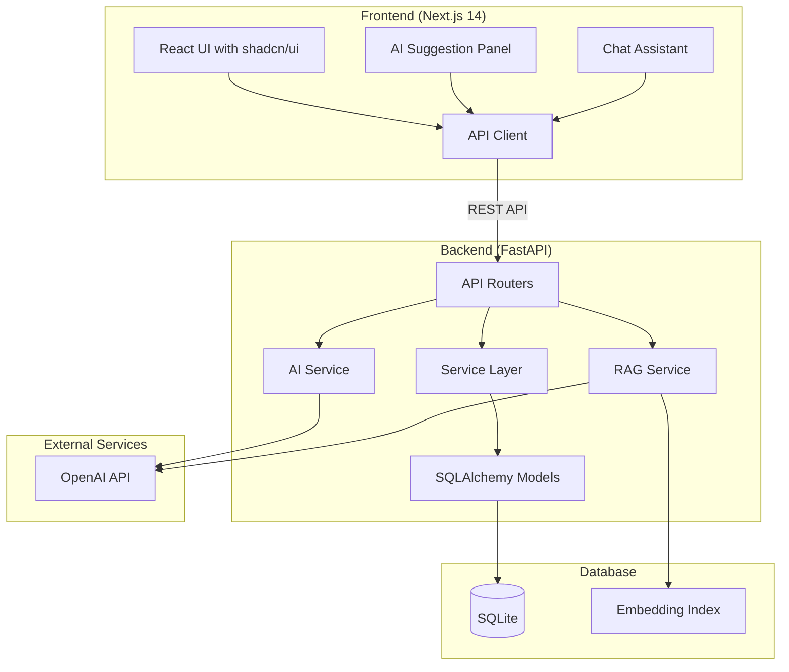
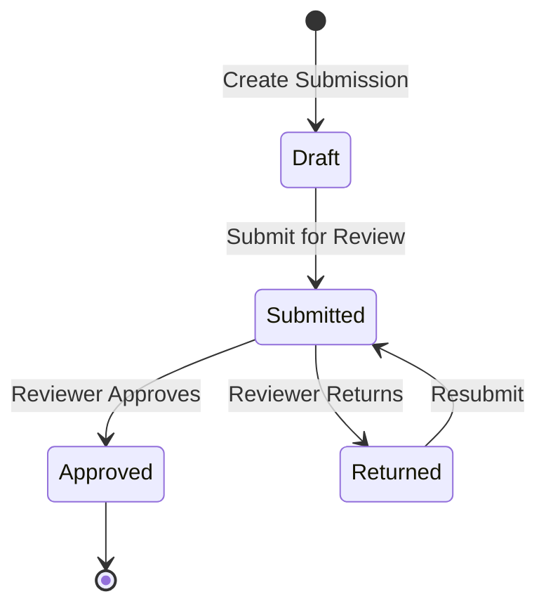

# AI/GenAI Security Review

A web application for managing information security reviews of AI and Generative AI projects. Organizations can use this tool to ensure AI/GenAI projects meet security, privacy, and compliance requirements through a structured questionnaire and review workflow.

## Architecture Overview



### Workflow



## Tech Stack

| Layer      | Technology                                 |
|------------|--------------------------------------------|
| Frontend   | Next.js 14 (App Router), TypeScript, Tailwind CSS, shadcn/ui |
| Backend    | Python 3.11+, FastAPI, SQLAlchemy 2.0, Pydantic v2 |
| Database   | SQLite (via SQLAlchemy)                    |
| State Mgmt | Zustand                                    |
| Icons      | Lucide React                               |
| AI/LLM     | Multi-provider: OpenAI, LiteLLM (local), AWS Bedrock |
| RAG        | Custom chunking + cosine similarity (numpy/sklearn) |
| Container  | Docker + Docker Compose                    |

## Prerequisites

- **Python 3.11+**
- **Node.js 20+**
- **Docker & Docker Compose** (optional, for containerized setup)
- **LLM Provider** (one of the following):
  - **OpenAI API Key** - For cloud-based AI (requires API key)
  - **LiteLLM + Ollama** - For local AI (free, runs on your machine)
  - **AWS Bedrock** - For enterprise AI (requires AWS account)

## Quick Start

### Option 1: Docker Compose (Recommended)

```bash
# Clone the repository
git clone https://github.com/atakkallapalli/ai-security-review.git
cd ai-security-review

# Start all services
docker-compose up --build

# Frontend: http://localhost:3000
# Backend:  http://localhost:8000
# API Docs: http://localhost:8000/docs
```

### Option 2: Manual Setup

#### Backend

```bash
cd backend

# Create virtual environment
python -m venv venv
source venv/bin/activate  # On Windows: venv\Scripts\activate

# Install dependencies
pip install -r requirements.txt

# Copy environment file
cp .env.example .env

# Run the server (auto-seeds database on first start)
uvicorn app.main:app --reload --port 8000
```

#### Frontend

```bash
cd frontend

# Install dependencies
npm install

# Run the dev server
npm run dev
```

Open [http://localhost:3000](http://localhost:3000) in your browser.

## Project Structure

```
ai-security-review/
├── backend/
│   ├── app/
│   │   ├── main.py              # FastAPI application entry point
│   │   ├── config.py            # Settings via pydantic-settings
│   │   ├── database.py          # SQLAlchemy engine & session
│   │   ├── models/
│   │   │   └── models.py        # SQLAlchemy ORM models (14 models)
│   │   ├── schemas/
│   │   │   └── schemas.py       # Pydantic request/response schemas
│   │   ├── routers/
│   │   │   ├── questions.py     # CRUD endpoints for questions & categories
│   │   │   ├── submissions.py   # Submission lifecycle endpoints
│   │   │   ├── reviews.py       # Review workflow endpoints
│   │   │   ├── notifications.py # Notification endpoints
│   │   │   ├── ai.py            # AI suggestion & chat endpoints (Phase 2)
│   │   │   └── policies.py      # Policy document CRUD & RAG indexing (Phase 2)
│   │   └── services/
│   │       ├── question_service.py     # Question business logic
│   │       ├── submission_service.py   # Submission business logic
│   │       ├── review_service.py       # Review business logic
│   │       ├── notification_service.py # Notification business logic
│   │       ├── ai_service.py           # OpenAI suggestion & chat (Phase 2)
│   │       └── rag_service.py          # RAG chunking, embedding, retrieval (Phase 2)
│   ├── seed_data.py             # Database seeding script
│   ├── requirements.txt
│   ├── Dockerfile
│   └── .env.example
├── frontend/
│   ├── src/
│   │   ├── app/
│   │   │   ├── layout.tsx       # Root layout with navigation
│   │   │   ├── page.tsx         # Landing page
│   │   │   ├── submit/          # Submission wizard pages
│   │   │   ├── my-submissions/  # Submission tracking
│   │   │   └── admin/           # Admin dashboard, questions, submissions & policies
│   │   ├── components/
│   │   │   ├── ui/              # shadcn/ui components
│   │   │   └── ai/              # AI suggestion & chat components (Phase 2)
│   │   └── lib/
│   │       ├── api.ts           # API client wrapper
│   │       ├── types.ts         # TypeScript interfaces
│   │       └── utils.ts         # Utility functions
│   ├── Dockerfile
│   └── package.json
├── docker-compose.yml
├── .env
├── .gitignore
└── README.md
```

## Database Models

The application includes 14 SQLAlchemy models:

| Model                 | Description                                    |
|-----------------------|------------------------------------------------|
| QuestionCategory      | Groups questions into logical sections          |
| Question              | Individual questionnaire items                  |
| QuestionCondition     | Conditional display rules between questions     |
| QuestionPolicyLink    | Links questions to policy documents             |
| QuestionnaireVersion  | Version tracking for questionnaire updates      |
| Submission            | Project submission with metadata                |
| SubmissionResponse    | Individual answers to questions                 |
| SubmissionAttachment  | File uploads associated with submissions        |
| Review                | Reviewer decisions (approve/return)             |
| ReviewComment         | Per-question review comments                    |
| PolicyDocument        | Reference policy documents                      |
| DocumentTag           | Tags associated with policy documents           |
| MasterTag             | Centralized tag definitions                     |
| Notification          | In-app notification records                     |

## API Endpoints

### Questions
- `GET /api/questions` — List all questions
- `POST /api/questions` — Create a question
- `GET /api/questions/{id}` — Get question by ID
- `PUT /api/questions/{id}` — Update a question
- `DELETE /api/questions/{id}` — Delete a question
- `PATCH /api/questions/reorder` — Reorder questions
- `GET /api/questions/categories` — List categories
- `POST /api/questions/categories` — Create a category
- `GET /api/questions/preview` — Get questions in submitter-facing order

### Submissions
- `GET /api/submissions` — List submissions (filter by email)
- `POST /api/submissions` — Create a submission
- `GET /api/submissions/{id}` — Get submission with responses
- `POST /api/submissions/{id}/responses` — Save responses
- `POST /api/submissions/{id}/submit` — Submit for review
- `GET /api/submissions/{id}/progress` — Get progress

### Reviews
- `GET /api/reviews/queue` — Get review queue
- `GET /api/reviews/submission/{id}` — Get submission for review
- `POST /api/reviews/submission/{id}/approve` — Approve submission
- `POST /api/reviews/submission/{id}/return` — Return with comments

### Notifications
- `GET /api/notifications?email=...` — Get notifications
- `PATCH /api/notifications/{id}/read` — Mark as read
- `GET /api/notifications/unread-count?email=...` — Get unread count

### AI (Phase 2)
- `POST /api/ai/suggest` — Get AI suggestion for a question
- `POST /api/ai/chat` — Chat with AI assistant
- `GET /api/ai/status` — Get AI feature configuration status

### Policy Documents (Phase 2)
- `GET /api/policies` — List all policy documents
- `POST /api/policies` — Create a policy document (auto-indexes for RAG)
- `GET /api/policies/{id}` — Get policy document
- `PUT /api/policies/{id}` — Update policy document (re-indexes)
- `DELETE /api/policies/{id}` — Delete policy document
- `POST /api/policies/{id}/index` — Manually trigger RAG indexing
- `POST /api/policies/search` — Search indexed policies via RAG
- `GET /api/policies/index/stats` — Get RAG index statistics

## Seed Data

The application automatically seeds the database on first startup with:
- **11 question categories** covering security review domains
- **33 sample questions** across all categories with various types
- **Conditional logic** examples (e.g., PII follow-up questions)

## Phase Roadmap

| Phase | Description                                    | Status      |
|-------|------------------------------------------------|-------------|
| 1     | Core questionnaire, submission & review workflow | Complete    |
| 2     | AI-powered suggestions, RAG chat assistant      | Complete    |
| 3     | Advanced conditional logic, drag-and-drop reorder| Current    |
| 4     | SSO integration, role-based access control      | Planned     |
| 5     | Analytics dashboard, reporting, audit trails    | Planned     |

## Phase 2: AI Features

### Multi-Provider LLM Support
**NEW:** The application now supports three LLM providers:

1. **OpenAI** - Cloud-based GPT models (easy setup, high quality)
2. **LiteLLM** - Local/self-hosted LLMs via Ollama (free, private)
3. **AWS Bedrock** - Enterprise AWS service (Claude, Titan models)

Switch between providers by setting `LLM_PROVIDER` in `.env`. See [Multi-Provider LLM Guide](backend/docs/MULTI_PROVIDER_LLM.md) for detailed setup instructions.

**Quick Setup Examples:**

```bash
# Option 1: OpenAI (Cloud)
LLM_PROVIDER=openai
OPENAI_API_KEY=sk-proj-your-key

# Option 2: LiteLLM (Local)
LLM_PROVIDER=litellm
LITELLM_API_BASE=http://localhost:4000
LITELLM_MODEL_ID=ollama/llama2

# Option 3: AWS Bedrock (Enterprise)
LLM_PROVIDER=bedrock
BEDROCK_REGION=us-east-1
BEDROCK_MODEL_ID=anthropic.claude-3-sonnet-20240229-v1:0
```

### AI Suggestion Panel
Each question in the submission wizard now includes an AI suggestion panel that:
- Generates context-aware answer suggestions using your chosen LLM provider
- Considers previous answers for better context
- References relevant policy documents via RAG
- Shows confidence level and policy references
- Allows one-click "Use this suggestion" to populate the answer

### Chat Assistant
An expandable chat panel on each question page allows users to:
- Ask questions about security requirements
- Get explanations of compliance considerations
- Receive guidance specific to the current question
- Maintain conversation history within each question

### RAG Pipeline
- Policy documents are chunked and embedded using your chosen provider
- Embeddings stored locally (JSON files in `backend/data/embeddings/`)
- Cosine similarity search retrieves relevant policy chunks
- Retrieved context is injected into AI suggestion and chat prompts
- **Note:** When switching providers, re-index policy documents for compatibility

### Policy Document Management
New admin page (`/admin/policies`) for managing policy documents:
- Create, edit, and delete policy documents
- Automatic RAG indexing on create/update
- Manual re-indexing capability
- RAG search testing interface
- Tag-based organization

### Configuration
Configure your preferred LLM provider in `.env`. The app works without AI — features will show a disabled state with instructions.

**Test your configuration:**
```bash
cd backend
python test_llm_provider.py
```

See [Multi-Provider LLM Guide](backend/docs/MULTI_PROVIDER_LLM.md) for complete setup instructions.

## Phase 3: Advanced Conditional Logic & Reordering

### Drag-and-Drop Question Reordering
The admin question management page now supports:
- Drag-and-drop reordering within each category using grip handles
- Optimistic UI updates with automatic server persistence
- Visual grip handle indicator on each question row

### Visual Conditional Logic Builder
Replace the Phase 1 placeholder with a full visual builder:
- Add/remove conditions with a visual card-based interface
- Select which question's answer to check via dropdown
- Choose from 9 operators: Equals, Not Equals, Contains, Does Not Contain, Greater Than, Less Than, Matches Regex, Is Empty, Is Not Empty
- Enter expected value (hidden for is_empty/is_not_empty)
- AND logic: all conditions must be met for the question to show
- Amber-themed UI with condition count badges

### Bulk Import/Export
- **Export**: Download all questions as a JSON file with conditions, categories, and metadata
- **Import**: Paste JSON to import questions with optional "overwrite" mode
- Categories are auto-created during import if they don't exist

### New API Endpoints
- `GET /api/questions/{id}/conditions` — List conditions for a question
- `POST /api/questions/{id}/conditions` — Add a condition
- `PUT /api/questions/{id}/conditions` — Replace all conditions (visual builder)
- `DELETE /api/questions/conditions/{id}` — Delete a condition
- `GET /api/questions/bulk/export` — Export all questions as JSON
- `POST /api/questions/bulk/import` — Import questions from JSON

## License

Internal use only.
